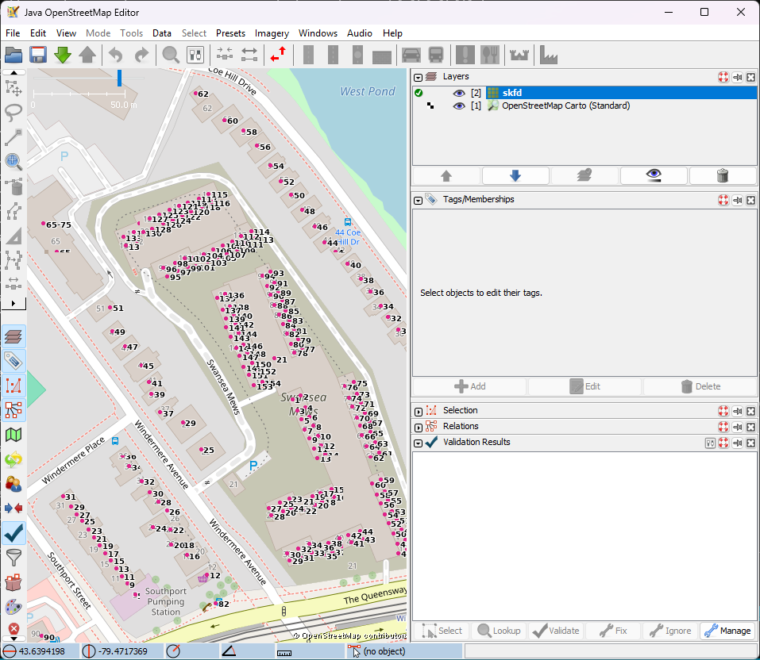

# Toronto Addresses Layer

Turns the City of Toronto [Address Points](https://open.toronto.ca/dataset/address-points-municipal-toronto-one-address-repository/)
dataset (~525,000 addresses) into map-tile layers that OpenStreetMap mappers can
add to the **JOSM** and **iD** editors as a reference overlay.

It is a sibling of [toronto-addresses-import](https://github.com/skfd/toronto-addresses-import)
but standalone: the City publishes the data already in WGS84, so this project
downloads it directly and has no dependency on the import project's database.



## What it produces

- **Vector tiles** (MVT) &mdash; interactive in iD; click a point to read its tags.
- **Raster tiles** (PNG) &mdash; house numbers drawn as text; a readable backdrop for JOSM.
- A **landing page** with copy-paste "add this layer" instructions for both editors.

All of it is published to GitHub Pages and rebuilt daily.

## Setup

1. Install Python dependencies:
   ```
   pip install -r requirements.txt
   ```
2. Set up WSL2 + tippecanoe once &mdash; see [wsl-setup.md](wsl-setup.md).
3. Confirm the GitHub repo in `src/config.py` (`GITHUB_REPO`, `PAGES_URL`).

## Usage

```
python run.py download   # fetch the latest address GeoJSON (smart-cached)
python run.py slim       # stream it into a slim GeoJSONL
python run.py vector     # build vector (MVT) tiles via WSL tippecanoe
python run.py raster     # build labelled raster (PNG) tiles
python run.py site       # render the landing page
python run.py publish    # force-push the site to the gh-pages branch

python run.py build      # download + slim + vector + raster + site
python run.py update     # build + publish  (the daily entry point)
```

Build output lands in `build/site/`; that directory is what gets published.

## Hosting

The tile pyramid is published to an orphan `gh-pages` branch, recreated and
force-pushed on every build so repository history never grows. One-time step:
in the GitHub repo, set **Settings &rarr; Pages &rarr; Source** to the
`gh-pages` branch (root).

## Scheduling (Windows)

Run as Administrator:

```powershell
.\schedule-add.ps1      # registers a daily task "TorontoAddressLayer" at 14:00
.\schedule-remove.ps1   # unregisters it
```

The task runs `python run.py update` and appends output to `logs\scheduler.log`.
It is set for 14:00 &mdash; about two hours after the sibling import task &mdash;
so fresh city data is available before tiles are built.

## Tests

```
python tests\test_tilemath.py
```

## Licence / attribution

Address data is &copy; City of Toronto, published under the
[Open Government Licence &ndash; Toronto](https://open.toronto.ca/open-data-licence/).
Tiles and the landing page carry that attribution.
