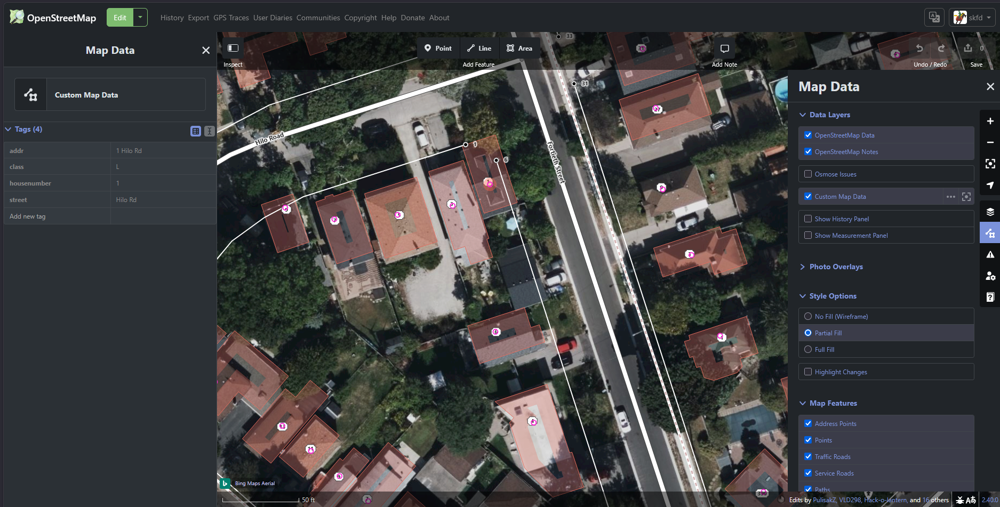

# Toronto Addresses Layer

Turns the City of Toronto [Address Points](https://open.toronto.ca/dataset/address-points-municipal-toronto-one-address-repository/)
dataset (~525,000 addresses) into map-tile layers (interactive vector + labelled
raster) that OpenStreetMap mappers can add to the **iD** and **JOSM** editors as
a reference overlay.

**Live layer and how to add it: https://skfd.github.io/toronto-addresses-layer/**




This is a thin repo: the whole pipeline is the
[`address-layerist`](../address-layerist) engine. All that lives here is
[`layer.toml`](layer.toml) (the data source + field map + site settings) and a
`run.py` shim.

## Setup

```
pip install -r requirements.txt          # the engine + its deps
```

The vector-tile step needs WSL2 + tippecanoe once -- see
[../address-layerist/wsl-setup.md](../address-layerist/wsl-setup.md).

## Usage

```
python run.py fetch      # download the latest address GeoJSON (smart-cached)
python run.py slim       # stream it into a slim GeoJSONL + meta
python run.py vector     # vector (MVT) tiles via WSL tippecanoe
python run.py raster     # labelled raster (PNG) tiles
python run.py site       # render the landing page

python run.py build      # all of the above
python run.py update     # build + publish (the daily entry point)
```

Build output lands in `build/site/`; that directory is what gets published to an
orphan `gh-pages` branch (history never grows).

## Scheduling (Windows)

Run as Administrator:

```powershell
.\schedule-add.ps1       # registers a daily task "TorontoAddressLayer" at 14:00
.\schedule-remove.ps1    # unregisters it
```

The task runs `python run.py update`. It is set for 14:00 -- about two hours
after the sibling [toronto-addresses-import](https://github.com/skfd/toronto-addresses-import)
task -- so fresh city data is available before tiles are built.

## Licence / attribution

Address data is &copy; City of Toronto, published under the
[Open Government Licence &ndash; Toronto](https://open.toronto.ca/open-data-licence/).
Tiles and the landing page carry that attribution.
